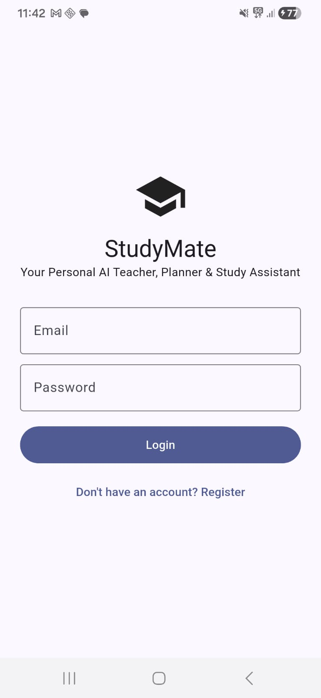
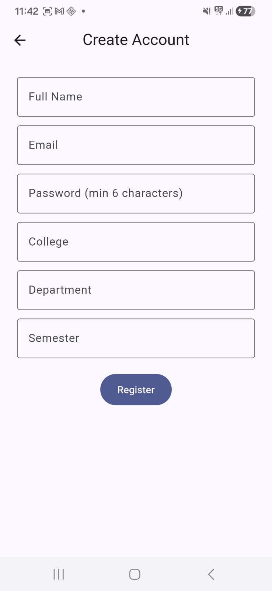
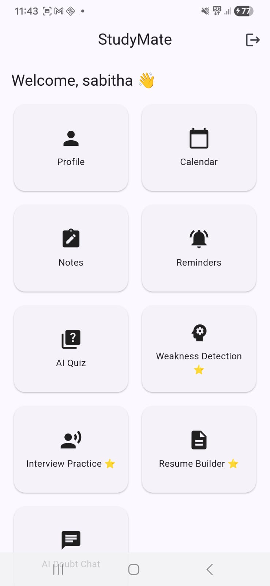
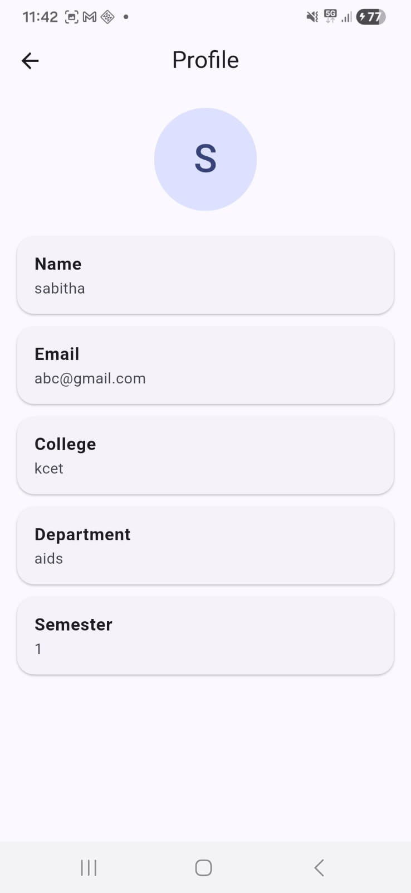
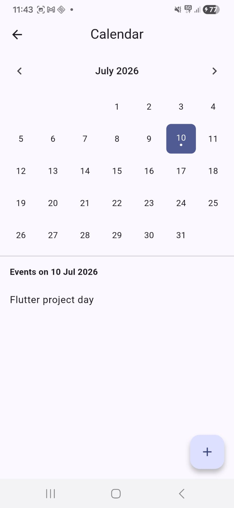

# 📚 StudyMate - Flutter Student Companion App

StudyMate is a Flutter-based student companion application designed to help students manage their academic activities efficiently.

The application provides a clean interface with modules like notes management, task tracking, and student productivity features.

This project was developed as part of a Flutter Value Added Course and focuses on practical mobile application development using Flutter and Dart.

---

## ✨ Features

- 📖 Notes Management
- ✅ Task Management
- 📅 Timetable Management
- 🗄️ Database Integration
- 📱 User-friendly Flutter UI
- 👥 Team-based Project Development

---

## 🛠️ Technologies Used

- Flutter
- Dart
- Android Studio
- SQLite Database

---


## ⚠️ Important: this replaces the React Native project from earlier

You do **not** need Node.js, npm, or the `StudyMateMobile` React Native folder
for this. Flutter is a separate toolchain (Dart language, Flutter SDK). Your
Android Studio + emulator setup from before is still useful — Flutter uses
the same emulator.

---

## Step 1 — Install the Flutter SDK

1. Go to **https://docs.flutter.dev/get-started/install/windows**
2. Download the Flutter SDK zip for Windows.
3. Extract it somewhere permanent, e.g. `C:\src\flutter` (avoid `Program Files` — it can cause permission issues).
4. Add Flutter to your PATH:
   - Windows key → search **"environment variables"** → **Edit the system environment variables** → **Environment Variables**
   - Under "User variables," select **Path** → **Edit** → **New**
   - Add: `C:\src\flutter\bin`
   - OK on everything, then **fully restart VS Code**.
5. Confirm it worked — new terminal:
   ```
   flutter --version
   ```

## Step 2 — Run Flutter Doctor

```
flutter doctor
```
This checks your whole setup (Android toolchain, VS Code, licenses) and tells you exactly what's missing, in plain English. Fix anything it flags with a ✗ before continuing — it usually tells you the exact command to run (e.g. `flutter doctor --android-licenses`).

## Step 3 — Install the Flutter & Dart VS Code extensions

1. In VS Code, click the Extensions icon (left sidebar).
2. Search **"Flutter"** → install the official one (by Dart Code) — this pulls in the Dart extension automatically.

## Step 4 — Generate the native project shell

This scaffold gives you `lib/`, `pubspec.yaml`, etc. — but Flutter also needs
native `android/` and `ios/` folders, which only `flutter create` can generate
correctly (same reason `react-native init` was needed before).

In a terminal, navigate to where you want the project (e.g. Desktop) and run:
```
flutter create studymate_flutter
```
This creates a fresh, complete Flutter project with native folders.

## Step 5 — Merge this scaffold into it

From this scaffold, copy into the newly created `studymate_flutter` folder,
**overwriting** when prompted:
- `lib/` (replace entirely)
- `pubspec.yaml` (replace)
- `analysis_options.yaml` (replace)
- `test/` (replace)
- `assets/` (add — create the folder if it doesn't exist)

**Do not** touch the generated `android/`, `ios/`, `web/`, `.metadata`, or
`.gitignore` from `flutter create` — those are the real native project files.

## Step 6 — Install dependencies

```
cd studymate_flutter
flutter pub get
```
This reads `pubspec.yaml` and downloads every package. Watch for red errors —
if a version conflict appears, `flutter pub get` usually tells you exactly
which package to bump.

## Step 7 — Run it

1. Open Android Studio → Device Manager → start your emulator (▶️), wait for it to fully boot.
2. Back in VS Code terminal:
   ```
   flutter run
   ```
3. First build takes a few minutes. When done, the emulator shows the **Login screen**.

## What "success" looks like

- Login screen appears with a StudyMate title and email/password fields.
- Tap **Login** (no real auth wired up yet, it just proceeds) → lands on the **Dashboard**.
- Dashboard shows a scrollable grid of every module (Notes, Timetable, AI Teacher, Weakness Detection, Resume Builder, Interview Practice, etc.) — tap any tile to open that screen's placeholder.

That confirms your whole toolchain works end to end. From here, build out one module at a time, starting with Notes and Flashcards (the modules everything else builds on).

---

## 📱 Screenshots

### Login Screen


### register Screen


### Dashboard


### profile


### calendar Screen


### Notes Screen


---

## Where things live

```
lib/
  main.dart              → entry point
  app.dart                → MaterialApp, theme, routes
  core/
    theme/                → light/dark theme
    routes/                → central route table — add new screens here
  models/                 → data models (matches Spec Section 5 tables)
  services/                → auth_service, ai_service, notification_service, database_service
  features/                → one folder per module, each with screens/
  widgets/common/         → shared reusable widgets go here
```
---

## 👩‍💻 Author

**Arthy S**

B.Tech Student | Flutter Developer

GitHub:
https://github.com/arthys06

## Priority build order (matches the spec's investment guidance)

1. **Auth + Dashboard** (already wired for navigation)
2. **Notes, Timetable, Reminders, Assignments** — core daily-use loop
3. **Pomodoro, Attendance, Exam Countdown, Habit/Water/Sleep/Mood trackers**
4. **Flashcards + AI Quiz Generator** — feeds data into Weakness Detection
5. ⭐ **AI Teacher, Scan Question, AI Weakness Detection, AI Resume Builder,
   AI Interview Practice, AI Code Helper, AI Semester Planner, AI Doubt Chat**
   — the differentiator features, once the data pipeline above exists to feed them
